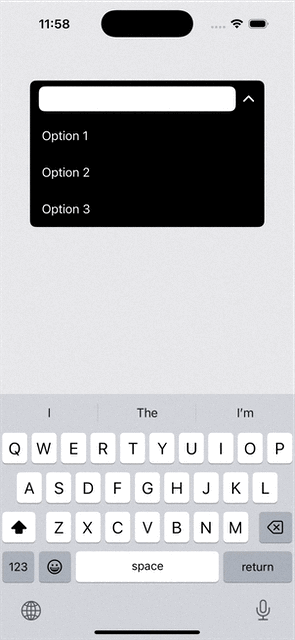

# SwiftUI Select Box

Single or Multiple Select box implemented in SwiftUI.

Behavior is similar to the Select2, react-select, or the iOS message app (the *To:* field).

### Single Selection
[SingleSelectBox](./SingleSelectBox.swift)

### Multi Selection
[MultiSelectBox](./MultiSelectBox.swift)

### Further Details
- [SwiftUI: Single-Selection Select Box]()
- [SwiftUI: Multi-Selection Select Box]()
